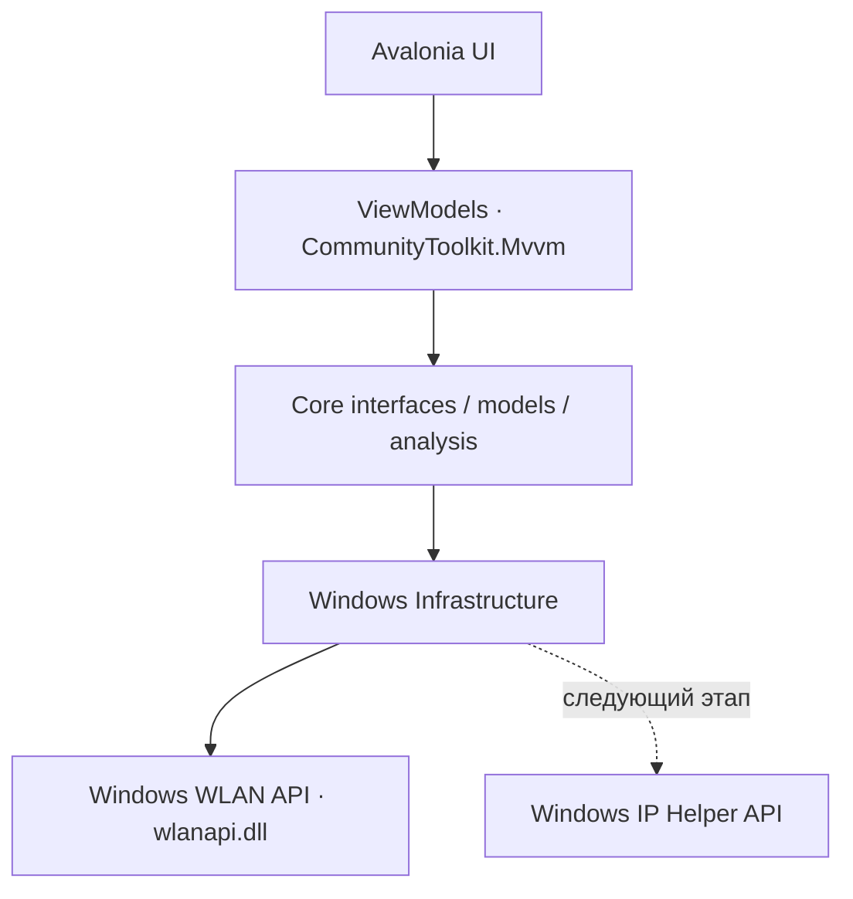

# Wireless Security Analyzer

Desktop-приложение на C# / .NET 10 / Avalonia 12.1.3 для анализа Wi-Fi среды и, на следующих этапах, собственной локальной IP-сети. Основная платформа — Windows 10/11 x64. Интерфейс на русском языке; браузер и веб-сервер не используются.

Реализован код первого этапа ТЗ: ручное сканирование через Windows Native Wi-Fi API, отображение BSS и обработка ошибок. Проверка реального сканирования на Windows с Wi-Fi адаптером ещё необходима. Мониторинг RSSI, ScottPlot, анализ каналов и обнаружение устройств будут добавлены последовательно после этой проверки. Разделы будущих функций сейчас содержат явные сообщения о состоянии реализации.

## Требования

- Для разработки: .NET 10 SDK; `global.json` разрешает стабильные feature bands .NET 10.
- Для реального сканирования: Windows 10/11 x64, Wi-Fi адаптер с драйвером, запущенная служба **WLAN AutoConfig** (автонастройка WLAN), включённое радио Wi-Fi.
- Windows может требовать разрешение определения местоположения и доступ для классических приложений. При отказе приложение показывает объяснение и кнопку открытия `ms-settings:privacy-location`.
- Права администратора для обычного WLAN scan не требуются. Конкретные ограничения зависят от настроек Windows и драйвера.
- Для запуска self-contained публикации установка .NET Runtime пользователю не нужна. Переносить нужно всю папку публикации вместе с `.exe` и native dependencies.

## Сборка и запуск

Из корня репозитория:

```powershell
dotnet restore WirelessSecurityAnalyzer.sln
dotnet build WirelessSecurityAnalyzer.sln --no-restore
dotnet test WirelessSecurityAnalyzer.sln --no-build
dotnet run --project src/WirelessSecurityAnalyzer.App
```

Версии пакетов зафиксированы в `Directory.Packages.props`; каждый проект содержит `packages.lock.json`. Для воспроизводимой проверки зависимостей используйте `dotnet restore --locked-mode`.

На Linux можно собрать solution и выполнить Core, managed interop и headless UI tests. Вызов `wlanapi.dll` на Linux недоступен: приложение показывает сообщение о неподдерживаемой платформе и не подменяет данные демонстрационными. SDK для текущей Linux-среды установлен в `/home/galkin/.local/share/wsa-dotnet`; для этой машины можно добавить каталог в PATH или вызвать `dotnet` по полному пути. Этот путь не используется приложением.

Публикация для Windows:

```powershell
dotnet publish src/WirelessSecurityAnalyzer.App -c Release -p:PublishProfile=WindowsX64
```

Результат: `publish/win-x64/WirelessSecurityAnalyzer.exe`. Включены .NET Runtime и зависимости Avalonia; single-file publishing и trimming выключены для надёжной загрузки XAML и native libraries.

В текущей рабочей копии также подготовлен `publish/WirelessSecurityAnalyzer-win-x64.zip`: перенесите архив на Windows, полностью распакуйте и запустите `win-x64/WirelessSecurityAnalyzer.exe`. Артефакты сборки исключены из Git.

## Использование

Откройте раздел **Эфир** и нажмите **Сканировать**. В таблице показаны SSID, BSSID, фактический RSSI в dBm, визуальный индикатор сигнала, канал, диапазон, центральная частота и время обнаружения. Поддерживаются поиск по SSID/BSSID, фильтр 2,4/5/6 ГГц и сортировка по RSSI. Скрытая сеть обозначается отдельно.

Кнопка **Отмена** прекращает ожидание операции. Windows не предоставляет отмену уже отправленного `WlanScan`: системное сканирование может закончиться позже. Последние успешные данные сохраняются при отмене или ошибке; успешное сканирование заменяет набор BSS. Повторное нажатие во время операции не запускает параллельный scan.

В **Обзоре** отображаются количество BSS по диапазонам и обнаруженные адаптеры. **Настройки** содержат доступ к разрешениям Windows и путь локальных журналов.

## Архитектура

```text
WirelessSecurityAnalyzer.sln
src/
  WirelessSecurityAnalyzer.App/                    # net10.0-windows: Avalonia, MVVM, DI
    Views/, ViewModels/, Controls/, Styles/
  WirelessSecurityAnalyzer.Core/                   # net10.0: модели, интерфейсы, расчёты
    Models/, Interfaces/, Analysis/, Common/
  WirelessSecurityAnalyzer.Infrastructure.Windows/ # net10.0-windows: Native Wi-Fi
    NativeWifi/, Wifi/, Interop/, Services/
tests/
  WirelessSecurityAnalyzer.Core.Tests/
  WirelessSecurityAnalyzer.Windows.Tests/
docs/
  WINDOWS_VALIDATION.md
  IMPLEMENTATION_STATUS.md
```



Core не зависит от Avalonia или P/Invoke. ViewModels получают интерфейсы через конструкторы. WindowsWifiScanner выполняет native-вызовы вне UI thread и сериализует запросы. На каждую операцию создаётся клиент с собственным SafeHandle. Он регистрирует callback **до** `WlanScan`, ожидает `scan_complete` / `scan_fail` через `TaskCompletionSource` и поддерживает тайм-аут 10 секунд на адаптер. После завершения снимается регистрация callback и освобождается handle; память списков освобождается через `WlanFreeMemory` в `finally`.

BSS отслеживаются по BSSID, даже когда SSID совпадает. При нескольких адаптерах одинаковые BSSID объединяются с выбором самого сильного измерения. Если один адаптер не смог выполнить scan, доступны результаты успешно просканированных адаптеров, а частичная ошибка записывается в журнал. Если ни один адаптер не завершил scan, ошибка показывается пользователю.

ObservableCollection существует только в UI. Результаты передаются как `IReadOnlyList` immutable records; обновления коллекции выполняются через UI Dispatcher с сохранением объектов строк. Code-behind ограничен представлением и запуском команды инициализации при открытии окна.

## Проверки

Core tests проверяют преобразования частоты ↔ канала для 2,4/5/6 ГГц, канал 14, специальный канал 2 на 5935 МГц и некорректные/граничные значения. Таблица преобразований не является перечнем каналов, разрешённых в конкретной стране.

Windows.Tests содержит проверки ABI структур, преобразования BSS, ошибок Win32, завершения/ошибки/тайм-аута/отмены callback, а также headless-проверки окна, навигации, фильтров, повторного scan и сохранения данных при ошибке. Детерминированный fake scanner находится только в тестовом проекте; production DI всегда регистрирует WindowsWifiScanner.

Аппаратный интеграционный тест по умолчанию пропускается. На Windows с Wi-Fi адаптером и разрешениями его можно явно включить:

```powershell
$env:WSA_RUN_WIFI_INTEGRATION_TESTS = '1'
dotnet test tests/WirelessSecurityAnalyzer.Windows.Tests --filter Category=WindowsIntegration
Remove-Item Env:WSA_RUN_WIFI_INTEGRATION_TESTS
```

Если ОС или Wi-Fi адаптер не поддерживаются, тест пропускается. При явном включении ошибки службы/разрешений должны быть устранены до проверки. Ручной чек-лист: [docs/WINDOWS_VALIDATION.md](docs/WINDOWS_VALIDATION.md).

## Данные и ограничения

Вся обработка выполняется локально. Нет внешних API, облачных сервисов, телеметрии приложения, передачи SSID/BSSID или журналов наружу. NuGet нужен при сборке для получения зависимостей.

Serilog пишет в `%LOCALAPPDATA%/WirelessSecurityAnalyzer/Logs/app-YYYYMMDD.log`; сохраняются 14 последних файлов. Логируются запуск, интерфейсы, начало/конец сканирования, число BSS и технические ошибки. SSID/BSSID намеренно не записываются в обычные сообщения журнала.

SSID является последовательностью байтов: для отображения применяется UTF-8 с заменой некорректных символов, управляющие символы визуально заменяются. Время обнаружения берётся из `ullHostTimestamp` драйвера; при некорректном timestamp используется время чтения. Драйвер/Windows могут возвращать кэшированный BSS list, поэтому результат не гарантирует ответ каждого AP именно на текущий scan.

Сканер видит BSS, доступные адаптерам и Windows. Он не определяет пароли, не подключается к найденным сетям, не вмешивается в соединения и не является RF spectrum analyzer. Channel width, security type, PHY details и глубокий IE parser пока не реализованы. MAC клиентов конкретной точки доступа из WLAN scan получить нельзя.

## Источники API

- [Avalonia 12.1: TableView](https://avaloniaui.net/blog/release-12-1).
- [Microsoft: WlanScan и уведомления о завершении](https://learn.microsoft.com/en-us/windows/win32/api/wlanapi/nf-wlanapi-wlanscan).
- [Microsoft: WLAN_BSS_ENTRY](https://learn.microsoft.com/en-us/windows/win32/api/wlanapi/ns-wlanapi-wlan_bss_entry).
- [Microsoft: ограничения доступа Wi-Fi и разрешение местоположения](https://learn.microsoft.com/en-us/windows/win32/nativewifi/wi-fi-access-location-changes).
