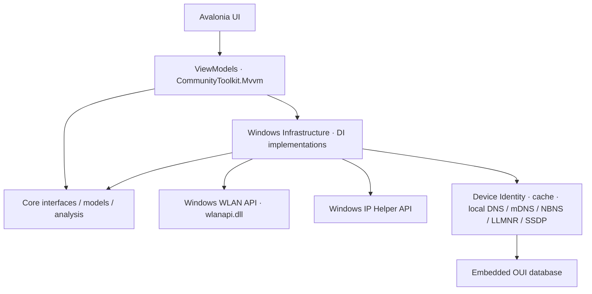

# Wireless Security Analyzer

Текущая версия — [Version 6 (6.0.0)](https://github.com/KirillBass/WIFI_Scanner/releases/tag/v6.0.0): расширенный «Эфир» с вендором точки доступа, стандартом Wi-Fi и режимом защиты; сканирование Wi-Fi, мониторинг RSSI, анализ каналов 2,4/5/6 ГГц, обнаружение устройств локальной IPv4-сети и асинхронное определение их имён и производителей. В релизе доступны готовый Windows-архив и контрольная сумма SHA-256.

Desktop-приложение на C# / .NET 10 / Avalonia 12.1.3 / ScottPlot.Avalonia 5.1.59 для анализа Wi-Fi среды и собственной локальной IP-сети. Основная платформа — Windows 10/11 x64. Интерфейс на русском языке; браузер и веб-сервер не используются.

Version 5 добавляет Device Identity: устройства появляются в таблице до завершения определения имени и производителя, затем обновляются асинхронно. Технические сведения находятся в [отчёте Device Identity](docs/DEVICE_IDENTITY_REPORT.md).

Version 6 расширяет «Эфир»: локальный вендор по BSSID, стандарт 802.11a/b/g/n/ac/ax/be, Wi-Fi 4/5/6/6E/7 и защита Open/WEP/WPA/WPA2/WPA3, включая Personal/Enterprise, WPA2/WPA3 transition и OWE. Данные берутся из Native Wi-Fi PHY и Beacon/Probe Response IE; неподтверждённые характеристики показываются как «Не определено». Шифры, PMF и источник защиты доступны в подсказке и деталях выбранной строки. Описание реализации — в [техническом отчёте «Эфир»](docs/AIR_CAPABILITIES_REPORT.md).

Реализован код первых четырёх этапов: ручное сканирование через Windows Native Wi-Fi API, мониторинг RSSI выбранного BSSID с историей/статистикой, оценочный анализ каналов с визуализацией перекрытия и обнаружение устройств собственной локальной сети. Аппаратная проверка на Windows с сетевым адаптером ещё необходима.

## Требования

- Для разработки: .NET 10 SDK; `global.json` разрешает стабильные feature bands .NET 10.
- Для реального сканирования: Windows 10/11 x64, Wi-Fi адаптер с драйвером, запущенная служба **WLAN AutoConfig** (автонастройка WLAN), включённое радио Wi-Fi.
- Для обнаружения устройств: активный Wi-Fi или Ethernet интерфейс с IPv4; полный обход доступен для подсетей до 1024 host-адресов, кроме /31 и /32.
- Windows может требовать разрешение определения местоположения и доступ для классических приложений. При отказе приложение показывает объяснение и кнопку открытия `ms-settings:privacy-location`.
- Права администратора для обычного WLAN scan не требуются. Конкретные ограничения зависят от настроек Windows и драйвера.
- Для запуска self-contained публикации установка .NET Runtime пользователю не нужна. Переносить нужно всю папку публикации вместе с `.exe` и native dependencies.

## Сборка и запуск

Из корня репозитория:

```powershell
dotnet restore WirelessSecurityAnalyzer.sln
dotnet build WirelessSecurityAnalyzer.sln --no-restore
dotnet run --project src/WirelessSecurityAnalyzer.App
```

Версии пакетов зафиксированы в `Directory.Packages.props`; каждый проект содержит `packages.lock.json`. Для воспроизводимой проверки зависимостей используйте `dotnet restore --locked-mode`.

На Linux можно собрать solution. Вызов `wlanapi.dll` на Linux недоступен: приложение показывает сообщение о неподдерживаемой платформе и не подменяет данные демонстрационными.

Публикация для Windows:

```powershell
dotnet publish src/WirelessSecurityAnalyzer.App -c Release -p:PublishProfile=WindowsX64
```

Результат: `publish/win-x64/WirelessSecurityAnalyzer.exe`. Включены .NET Runtime и зависимости Avalonia; single-file publishing и trimming выключены для надёжной загрузки XAML и native libraries.

Для запуска скачайте `WirelessSecurityAnalyzer-win-x64.zip` из релиза Version 6, полностью распакуйте и запустите `win-x64/WirelessSecurityAnalyzer.exe`. Для сборки из исходников используйте профиль публикации выше; локальный архив создаётся из папки `publish/win-x64/`. Артефакты сборки исключены из Git и распространяются отдельно от исходников.

## Использование

Откройте раздел **Эфир** и нажмите **Сканировать**. В таблице показаны SSID, BSSID, фактический RSSI в dBm, визуальный индикатор сигнала, канал, диапазон, центральная частота и время обнаружения. Поддерживаются поиск по SSID/BSSID, фильтр 2,4/5/6 ГГц и сортировка по RSSI. Скрытая сеть обозначается отдельно.

Кнопка **Отмена** прекращает ожидание операции. Windows не предоставляет отмену уже отправленного `WlanScan`: системное сканирование может закончиться позже. Последние успешные данные сохраняются при отмене или ошибке; успешное сканирование заменяет набор BSS. Повторное нажатие во время операции не запускает параллельный scan.

В **Обзоре** отображаются количество BSS по диапазонам, обнаруженные адаптеры и состояние мониторинга выбранной сети. **Настройки** содержат доступ к разрешениям Windows и путь локальных журналов.


### Мониторинг RSSI

После сканирования откройте **Сигнал**, выберите точку по комбинации SSID/BSSID/канала/RSSI и нажмите **Начать мониторинг**. Первое сканирование начинается сразу. Затем сервис ждёт выбранные 5, 10, 15, 30 или 60 секунд после завершения предыдущего сканирования. Общий `WifiScanService` координирует существующий `WindowsWifiScanner` и публикует успешные результаты для обеих страниц.

Для выбранного BSSID хранятся последние 300 реальных измерений RSSI. Время sample — момент получения успешного результата, а не метка кэшированной BSS драйвера. Текущий, средний, минимальный, максимальный RSSI, количество и последнее измерение рассчитываются по этому окну. График показывает время и dBm; история остаётся после **Остановить**, **Очистить историю** очищает её без остановки. Выбор точки и интервала блокируется на время мониторинга.

Если BSSID отсутствует, новый sample не создаётся, текущий показатель заменяется на «—», прежняя история сохраняется. После появления измерения продолжаются. Временные Timeout/ScanFailed допускают следующую попытку; отсутствие адаптера, выключенное радио, недоступная WLAN-служба, запрет доступа и неподдерживаемая платформа останавливают loop с понятным сообщением. Разрешения открываются через существующий Windows settings service.

Мониторинг продолжается при смене страницы. Закрытие главного окна отменяет операции и асинхронно дожидается их завершения. История хранится в памяти до закрытия приложения; сохраняется до 32 историй BSSID, более старые неактивные вытесняются. Результаты аппаратного сканирования зависят от Windows, адаптера и драйвера.

### Анализ каналов

Откройте **Каналы** после сканирования или при активном мониторинге. Выберите **2,4**, **5** или **6 ГГц**: график и таблица пересчитываются по последнему общему снимку без нового scan. При первом получении данных выбирается доступный диапазон, предпочтительно 2,4 ГГц. Последующий пользовательский выбор сохраняется. **Обновить анализ** запускает один запрос через тот же `WifiScanService`; независимого polling на странице нет.

Таблица показывает номер канала, центральную частоту, BSS непосредственно на канале, BSS с частотным перекрытием, оценку 0–100%, состояние и рекомендацию. График размещает каждую BSS по её реальной центральной частоте в МГц; высота пика соответствует RSSI в dBm. При наведении видны SSID, BSSID, канал и RSSI. Скрытые сети учитываются, одинаковые SSID с разными BSSID остаются отдельными BSS. Дубликаты BSSID объединяются с выбором сильнейшего RSSI; неизвестные частоты пропускаются с диагностикой. Канал и диапазон нормализуются по частоте.

Текущий scanner не извлекает достоверную ширину BSS. Поэтому явно используется **20 МГц (модель)**. Все вычисления и геометрия контура находятся в Core; View только передаёт готовые точки ScottPlot. Это инженерное приближение для сравнения Wi-Fi BSS, а не спектральная маска IEEE 802.11 или измерение airtime. Другие источники радиопомех такой анализ не обнаруживает.

При параметрах по умолчанию:

```text
SignalWeight = clamp((RSSI + 95) / 60, 0, 1)
OverlapFactor = clamp(1 - abs(BSS_frequency - candidate_frequency) / 20, 0, 1)
RawScore = сумма SignalWeight × OverlapFactor для BSS выбранного диапазона
LoadScorePercent = clamp(RawScore / 3 × 100, 0, 100)
```

Нормализация фиксирована: добавление сильной BSS на другом, не перекрывающемся канале не меняет проценты первого канала. Для центров, разделённых на 20 МГц и более, перекрытие равно нулю, в том числе в 5/6 ГГц. Уровни: менее 20% — «Свободен», 20–40% — «Низкая», 40–60% — «Средняя», 60–80% — «Высокая», от 80% — «Критическая»; верхние границы интервалов не включаются, кроме 100%.

Рекомендуется минимальная оценка. При равенстве выбирается меньшее число влияющих BSS, затем BSS на самом канале, затем меньший номер канала. Если в диапазоне нет валидных BSS или нет кандидатов, рекомендация отсутствует. Учитывается последний RSSI из общего снимка, независимо от активного мониторинга; собственная сеть автоматически не исключается. В `ChannelAnalysisOptions` предусмотрены коэффициенты, пороги, явный `ExcludedBssid` и переопределение кандидатов.

`WifiChannelCatalog` — заменяемый через `IChannelCandidateProvider` источник кандидатов. По умолчанию: 2,4 ГГц — 1–13, 14 добавляется только при обнаружении; 5 ГГц — распространённые 20-МГц каналы 36–64, 100–144 и 149–165 с соответствующим шагом; 6 ГГц — 1, 5, 9, …, 233, специальный канал 2 добавляется только при обнаружении. Настройка каталога может явно разрешать специальные каналы. Набор **не проверен для страны, адаптера и роутера**: это эвристическая рекомендация среди заданных кандидатов; каналы DFS и доступность 6 ГГц зависят от региона/оборудования. Сверяйте выбор с доступными настройками роутера.

Ошибки общего сканирования показываются через прежний `WifiErrorPresenter`, успешные данные сохраняются. Следующий успешный снимок снимает сообщение об ошибке. Остановка мониторинга сохраняет последний анализ, отмена обновления не создаёт ошибку, закрытие окна ожидает завершения и этой операции.

### Устройства локальной сети

Откройте **Устройства**. Список интерфейсов показывает активные Wi-Fi/Ethernet IPv4-контексты. Начальный приоритет: наличие шлюза → Wi-Fi → имя/идентификатор интерфейса → числовой IPv4; при нескольких вариантах сеть можно выбрать явно. Loopback, tunnel/PPP, неактивные интерфейсы, непригодные адреса и APIPA 169.254/16 исключаются. Ethernet поддерживается и без шлюза. В карточках отображаются описание интерфейса, IPv4 компьютера, подсеть/маска, шлюз и число известных/Online устройств.

**Сканировать** выполняет один цикл в выбранной локальной сети: читает Windows neighbor table, проверяет host-адреса через ICMP, повторно читает соседей и объединяет подтверждения и сразу показывает найденные устройства. Определение имён и производителей продолжается отдельной асинхронной задачей. Свой адрес не проверяется Ping: запись «Этот ПК» заполняется из интерфейса. Шлюз помечается в таблице, если его присутствие подтверждено; само наличие адреса шлюза в настройках не считается обнаружением.

Для обычных подсетей исключаются network/broadcast. Например, `192.168.1.20/24` даёт `192.168.1.1–254`, собственный адрес пропускается. До перечисления адресов действует предел **1024 host-адреса**: /22 с 1022 адресами допустима, более крупная сеть блокируется с пояснением. /31 и /32 вычисляются корректно, но автоматический обход для них явно отключён. Произвольный удалённый диапазон не задаётся.

По умолчанию: Ping timeout 500 мс, максимум 32 одновременных probe. Параметры discovery и порог Offline находятся в `DeviceDiscoveryOptions`. Identity-запросы ограничены четырьмя одновременными per-host операциями и четырьмя чтениями UPnP XML; timeout 1 секунда, multicast-окно 2 секунды. Параметры проверяются в `DeviceIdentityOptions`; cache хранит результаты 15 минут. Перед Ping проверяется системный маршрут: адреса, маршрутизируемые через другой интерфейс, например VPN, пропускаются с предупреждением. Соседи фильтруются по выбранному interface index и host-диапазону.

В таблице показаны **IP, роль, имя устройства, производитель, MAC, Ping, Online/Unknown/Offline, Last Seen и First Seen**. MAC добавляется только из валидных системных данных; отсутствие MAC/имени/ответа ICMP отображается как «—». Доступны поиск по IP/MAC/hostname/friendly name/vendor, фильтры состояния и сортировка по числовому IPv4, latency или последнему обнаружению. Строки обновляются на UI thread и сохраняют объекты при повторном сканировании; progress не пересоздаёт таблицу.

**Online** означает ответ ICMP, Reachable neighbor или новую/сменившую MAC валидную динамическую запись после probes. Неизменная Stale/Delay/Probe, Permanent, Incomplete или Unreachable запись сама по себе не подтверждает Online. Изменение счётчика возраста кэшированной записи также не является подтверждением. **Unknown** появляется при отсутствии свежих подтверждений, **Offline** — после трёх последовательных завершённых циклов с полным источником данных. Ошибки, отменённые/частичные циклы и пропущенные маршруты не увеличивают счётчик пропусков. При новом подтверждении состояние возвращается в Online; First Seen сохраняется, Last Seen обновляется только по реальному evidence. Валидный MAC служит основным ключом между циклами, IP — резервным; совпадение hostname устройства не объединяет.

**Начать мониторинг** запускает первый цикл сразу, затем ждёт выбранные **10/30/60/120 секунд** после завершения предыдущего. Ручной scan и monitoring защищены от одновременного запуска. **Остановить** отменяет текущую операцию/ожидание, сохраняя историю сессии. Мониторинг продолжается при смене вкладки; закрытие окна отменяет операции и ожидает их завершения. При исчезновении интерфейса, смене IPv4/prefix/шлюза мониторинг останавливается с пояснением; обновите список интерфейсов и повторите запуск. Новый контекст сети получает отдельную историю, предыдущий список не смешивается с ним.

Это устройства **локальной IP-сети**, а не association table выбранного Wi-Fi BSSID. AP/Client Isolation, guest VLAN, сон телефона и фильтрация ICMP могут скрывать доступные устройства. MAC может быть приватным/randomized, он не определяет владельца или заводского производителя. Приложение не обращается к внешним MAC lookup API и не сканирует порты/службы. Reverse DNS использует только DNS-серверы выбранного интерфейса, находящиеся в той же подсети. Публичные DNS-серверы и DNS через другой интерфейс пропускаются; RD=0 запрещает запрашивать рекурсивный поиск. История хранится в памяти до закрытия.

### Имя и производитель устройства

После появления строк могут отображаться «Определяется…» и индикатор фоновой идентификации. По окончании — найденное имя или «—». Наведите на имя/производителя: подсказка содержит полный hostname, friendly name, источник каждого вида данных, model/type, достоверность и время обновления. Горизонтальная полоса прокрутки позволяет видеть все колонки.

- **LocalComputer:** имя собственного ПК без сетевого запроса.
- **Reverse DNS:** PTR только к локальному DNS-серверу выбранного интерфейса; прямой запрос через стандартные .NET UDP API позволяет контролировать адрес сервера, timeout и отмену. OS-wide `Dns.GetHostEntryAsync` не применяется, поскольку его DNS destination нельзя ограничить выбранной сетью.
- **mDNS:** сетевой цикл к `224.0.0.251:5353`, пакетные reverse PTR и DNS-SD service questions. Из опубликованных PTR/A/SRV/TXT сопоставляются только уже найденные IP; исходный `.local` сохраняется. Запрашиваются отсутствующие SRV/TXT/A, максимум 64 дополнительных questions.
- **SSDP/UPnP:** один M-SEARCH к `239.255.255.250:1900`, затем description XML. LOCATION должен иметь literal IPv4 именно найденного ответившего устройства; hostname URL, внешние адреса, credentials и fragments отвергаются. Чтение ограничено 512 КБ, redirect/proxy/DTD/entities отключены; никаких control actions.
- **NetBIOS:** unicast read-only NBSTAT к UDP 137; выбирается уникальное workstation name, group names пропускаются.
- **LLMNR:** reverse PTR по unicast **TCP 5355** с TTL=1, как требует RFC 4795 для reverse queries. Unicast UDP для LLMNR не применяется.
- **OUI:** локальный embedded snapshot 58 242 MA-L/MA-M/MA-S префиксов, наиболее длинное совпадение. Источник и hash указаны в `Network/Identity/Data/README.md`; в runtime интернет-загрузки нет.

DisplayName: friendly name → hostname → «—». Vendor имеет отдельную колонку и не превращается в выдуманное имя/модель. Hostname: LocalComputer → mDNS → Reverse DNS → NetBIOS → LLMNR. Friendly name и model/type: SSDP → явные mDNS/DNS-SD данные. Vendor: UPnP manufacturer → OUI. Для locally administered MAC local bit `0x02` отключает OUI; без явного UPnP manufacturer показывается «Приватный / случайный MAC».

Cache process-local, TTL 15 минут, максимум 4096 записей: интерфейс/index + subnet/prefix + gateway + MAC, иначе IP. DHCP-смена IP при том же MAC сохраняет identity. Неуспех последующего запроса не стирает предыдущие значения. Пустой результат также кэшируется до TTL; частично отменённое незавершённое разрешение не кэшируется. Завершённые устройства большого batch сохраняются, чтобы повторные discovery не начинали обработку с первых адресов заново. Полного отдельного polling loop для имён нет.

Имя не гарантировано: устройство может не публиковать сведения, firewall/изоляция могут блокировать multicast/NBNS/LLMNR; legacy-unicast mDNS поддерживается не всеми устройствами. IPv6 не входит в этот этап. LOCATION с DNS hostname и UPnP HTTPS с недоверенным сертификатом пропускаются. OUI сообщает владельца адресного блока, зачастую изготовителя сетевого чипа, и не доказывает бренд готового устройства. Публичные примеры MAC из ТЗ не подменяют реестр.

## Архитектура

```text
WirelessSecurityAnalyzer.sln
src/
  WirelessSecurityAnalyzer.App/                    # net10.0-windows: Avalonia, MVVM, DI
    Views/, ViewModels/, Controls/, Styles/
  WirelessSecurityAnalyzer.Core/                   # net10.0: модели, интерфейсы, расчёты
    Models/, Interfaces/, Analysis/Channels/, Network/, Common/
  WirelessSecurityAnalyzer.Infrastructure.Windows/ # net10.0-windows: Native Wi-Fi
    NativeWifi/, Wifi/, Network/, Interop/, Services/
docs/
  IMPLEMENTATION_STATUS.md
  DEVICE_IDENTITY_REPORT.md
```



Core не зависит от Avalonia или P/Invoke. ViewModels получают интерфейсы через конструкторы. WifiScanService хранит общий read-only снимок и сериализует ручные/автоматические запросы; WindowsWifiScanner выполняет native-вызовы вне UI thread и сохраняет свою защиту от параллельных запросов. На каждую операцию создаётся клиент с собственным SafeHandle. Он регистрирует callback **до** `WlanScan`, ожидает `scan_complete` / `scan_fail` через `TaskCompletionSource` и поддерживает тайм-аут 10 секунд на адаптер. После завершения снимается регистрация callback и освобождается handle; память списков освобождается через `WlanFreeMemory` в `finally`.

BSS отслеживаются по BSSID, даже когда SSID совпадает. При нескольких адаптерах одинаковые BSSID объединяются с выбором самого сильного измерения. Если один адаптер не смог выполнить scan, доступны результаты успешно просканированных адаптеров, а частичная ошибка записывается в журнал. Если ни один адаптер не завершил scan, ошибка показывается пользователю.

ObservableCollection существует только в UI. Результаты передаются как `IReadOnlyList` immutable records; обновления коллекций выполняются через UI Dispatcher. «Эфир» и «Устройства» сохраняют объекты строк, «Каналы» отображают read-only результаты Core. Code-behind отвечает за представление, графики/подсказки и запуск команды инициализации при открытии окна. Discovery имеет отдельный модуль и не использует WLAN scan/monitor loop.

## Проверки

Тестирование выполняется локально, результаты сообщаются в чате. Тестовые проекты, настройки тестовых зависимостей и автоматические проверки GitHub не входят в публикуемый проект.

Реальное сканирование WLAN, IP Helper API и поведение драйверов требуют проверки на Windows с адаптером. Таблица преобразования частот и каналов не является перечнем каналов, разрешённых в конкретной стране.

## Данные и ограничения

Вся обработка выполняется локально. Нет cloud API, внешнего MAC lookup, телеметрии приложения, передачи SSID/BSSID/MAC или журналов наружу. Discovery использует ICMP своей подсети. Identity выполняет локальные PTR/mDNS/NBNS/LLMNR/SSDP запросы, читает только проверенное UPnP-описание ответившего найденного устройства и использует встроенную OUI-базу. Системный DNS fallback отсутствует; UPnP redirect, proxy, cookies и внешние XML entities запрещены. NuGet нужен при сборке для получения зависимостей.

Serilog пишет в `%LOCALAPPDATA%/WirelessSecurityAnalyzer/Logs/app-YYYYMMDD.log`; сохраняются 14 последних файлов. Логируются запуск, интерфейсы, начало/конец сканирования, число BSS и технические ошибки. SSID и RSSI каждого измерения не записываются на Information level; выбранный для мониторинга BSSID журналируется при запуске/остановке и исчезновении/восстановлении.

SSID является последовательностью байтов: для отображения применяется UTF-8 с заменой некорректных символов, управляющие символы визуально заменяются. Время обнаружения берётся из `ullHostTimestamp` драйвера; при некорректном timestamp используется время чтения. Драйвер/Windows могут возвращать кэшированный BSS list, поэтому результат не гарантирует ответ каждого AP именно на текущий scan.

Сканер видит BSS, доступные адаптерам и Windows. Он не определяет пароли, не подключается к найденным сетям, не вмешивается в соединения и не является RF spectrum analyzer. Channel width, security type, PHY details и глубокий IE parser пока не реализованы. MAC клиентов конкретной точки доступа из WLAN scan получить нельзя.

## Источники API

- [Avalonia 12.1: TableView](https://avaloniaui.net/blog/release-12-1).
- [Microsoft: WlanScan и уведомления о завершении](https://learn.microsoft.com/en-us/windows/win32/api/wlanapi/nf-wlanapi-wlanscan).
- [Microsoft: WLAN_BSS_ENTRY](https://learn.microsoft.com/en-us/windows/win32/api/wlanapi/ns-wlanapi-wlan_bss_entry).
- [Microsoft: ограничения доступа Wi-Fi и разрешение местоположения](https://learn.microsoft.com/en-us/windows/win32/nativewifi/wi-fi-access-location-changes).
- [Microsoft: GetIpNetTable2 и освобождение таблицы через FreeMibTable](https://learn.microsoft.com/en-us/windows/win32/api/netioapi/nf-netioapi-getipnettable2).
- [Microsoft: MIB_IPNET_ROW2 и состояния соседей](https://learn.microsoft.com/en-us/windows/win32/api/netioapi/ns-netioapi-mib_ipnet_row2).
- [Microsoft: асинхронный Ping с CancellationToken](https://learn.microsoft.com/en-us/dotnet/api/system.net.networkinformation.ping.sendpingasync?view=net-10.0).

- [RFC 6762: mDNS, one-shot queries и legacy-unicast ответы](https://www.rfc-editor.org/rfc/rfc6762).
- [RFC 6763: DNS-SD PTR/SRV/TXT](https://www.rfc-editor.org/rfc/rfc6763).
- [RFC 4795: LLMNR, reverse queries раздел 2.4](https://www.rfc-editor.org/rfc/rfc4795).
- [RFC 1002: NetBIOS node status](https://www.rfc-editor.org/rfc/rfc1002).
- [UPnP Device Architecture 2.0](https://upnp.org/specs/arch/UPnP-arch-DeviceArchitecture-v2.0.pdf).
