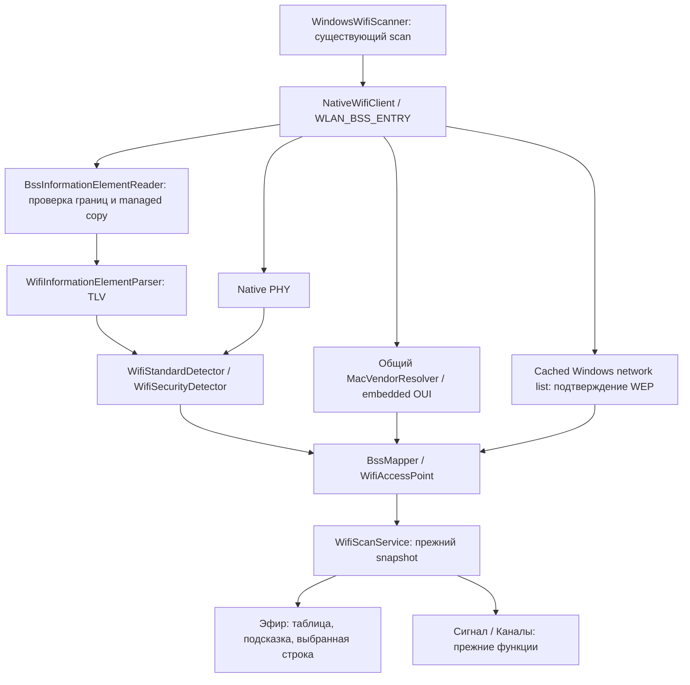

# Расширение «Эфира»: Vendor, Wi-Fi Standard, Security

Реализация ТЗ `WirelessSecurityAnalyzer_Air_Vendor_Standard_Security_Codex.docx` от 09.10.2026 поверх существующей Version 5 / Milestones 1–4 + Device Identity. Используются прежние solution, scanner, DI, scan snapshots и monitoring. Новых NuGet-зависимостей нет. Функционал включён в [Version 6 (6.0.0)](https://github.com/KirillBass/WIFI_Scanner/releases/tag/v6.0.0); номер сборки в Directory.Build.props и подпись главного окна обновлены до версии 6.

## 1. Изменённые файлы

Пути относительно корня репозитория:

| Файл | Изменение |
|---|---|
| `src/WirelessSecurityAnalyzer.Core/Models/WifiAccessPoint.cs` | Init-свойства Vendor, IsVendorLocallyAdministered, Standard, Security, IsSecurityEnabled; прежний конструктор сохранён. |
| `src/WirelessSecurityAnalyzer.Infrastructure.Windows/NativeWifi/BssMapper.cs` | Native PHY → enum, объединение IE/security/vendor с прежними измерениями. |
| `src/WirelessSecurityAnalyzer.Infrastructure.Windows/NativeWifi/NativeWifiClient.cs` | Копирование IE до освобождения native memory, parser, OUI и необязательное подтверждение WEP. |
| `src/WirelessSecurityAnalyzer.Infrastructure.Windows/NativeWifi/NativeWifiEnums.cs` | Идентификаторы Native PHY, Open/Shared authentication и WEP cipher. |
| `src/WirelessSecurityAnalyzer.Infrastructure.Windows/NativeWifi/NativeWifiMethods.cs` | Read-only WlanGetAvailableNetworkList. |
| `src/WirelessSecurityAnalyzer.Infrastructure.Windows/NativeWifi/NativeWifiStructs.cs` | Layout WLAN_AVAILABLE_NETWORK; прежний WLAN_BSS_ENTRY не изменён. |
| `src/WirelessSecurityAnalyzer.Infrastructure.Windows/Wifi/WindowsWifiScanner.cs` | Получает общий MacVendorResolver через существующий DI; прежний конструктор с logger доступен. |
| `src/WirelessSecurityAnalyzer.Infrastructure.Windows/Network/Identity/MacVendorResolver.cs` | Перегрузка Resolve(PhysicalAddress); Resolve(NetworkDevice) использует тот же путь. |
| `src/WirelessSecurityAnalyzer.App/ViewModels/AccessPointRowViewModel.cs` | Вендор, стандарт, защита, cipher/PMF/source и детали. |
| `src/WirelessSecurityAnalyzer.App/ViewModels/AccessPointsViewModel.cs` | Выбор строки, сохранение выбора при обновлении и очистка при фильтрации/исчезновении. |
| `src/WirelessSecurityAnalyzer.App/Views/AccessPointsView.axaml` | 10 колонок, горизонтальная прокрутка, security tooltip и панель деталей. |
| `README.md`, `docs/IMPLEMENTATION_STATUS.md` | Актуальные возможности и ограничения. |
| `Directory.Build.props`, `src/WirelessSecurityAnalyzer.App/Views/MainWindow.axaml` | Версия приложения и подпись окна для релиза 6.0.0. |

Также дополнено локальное объяснение `РАЗБОР_ПРОЕКТА_ЛОКАЛЬНО.md`; оно исключено через `.git/info/exclude` и не предназначено для публикации.

## 2. Новые файлы

| Файл | Назначение |
|---|---|
| `src/WirelessSecurityAnalyzer.Core/Models/WifiStandard.cs` | Enum PHY generation. |
| `src/WirelessSecurityAnalyzer.Core/Models/WifiSecurityInfo.cs` | Раздельные protocol/authentication/cipher/source, несколько pairwise suites, AKM и nullable PMF. |
| `src/WirelessSecurityAnalyzer.Core/Models/WifiCapabilities.cs` | Структурированный результат parser: HT/VHT/HE/EHT, RSN/WPA, security, признаки повреждения. |
| `src/WirelessSecurityAnalyzer.Core/Analysis/Wifi/WifiInformationElementParser.cs` | Независимый от ОС безопасный TLV parser и проверка длины capability/operation. |
| `src/WirelessSecurityAnalyzer.Core/Analysis/Wifi/WifiStandardDetector.cs` | Максимальный подтверждённый стандарт. |
| `src/WirelessSecurityAnalyzer.Core/Analysis/Wifi/WifiSecurityDetector.cs` | RSN/WPA suites, классификация и Open/WEP fallback. |
| `src/WirelessSecurityAnalyzer.Infrastructure.Windows/NativeWifi/BssInformationElementReader.cs` | Безопасная managed-копия IE из выделенного WLAN buffer. |
| `src/WirelessSecurityAnalyzer.Infrastructure.Windows/NativeWifi/WepFallbackResolver.cs` | Консервативное сопоставление с Windows security data. |
| `src/WirelessSecurityAnalyzer.App/ViewModels/WifiDisplayFormatter.cs` | Текст UI отдельно от enum/анализа. |
| `docs/AIR_CAPABILITIES_REPORT.md` | Этот отчёт из 15 пунктов. |

Новые локальные тесты `WifiMetadataTests.cs`, `BssCapabilitiesTests.cs` находятся вне репозитория, в `/home/galkin/.local/share/wsa-local-testing/WIFI_Scanner/tests/`. Отдельный GUI preview также остаётся локальным.

## 3. Как определяется Vendor

BSSID преобразуется в PhysicalAddress и передаётся существующему MacVendorResolver. Lookup выбирает наиболее длинный префикс 36 → 28 → 24 бита. Проверки валидного unicast MAC и locally administered bit переиспользованы из DeviceStateTracker/MacAddressHelper. Приватный BSSID не ищется в OUI: UI показывает «Локальный / приватный MAC». Для неизвестного назначения — «Не определено».

Это зарегистрированный владелец адресного блока, а не доказанная модель/марка роутера. Пример `10:A3:B8` из ТЗ не подменяет базу: в существующем снимке он принадлежит Iskratel d.o.o.

## 4. Где хранится OUI database

Прежний файл `src/WirelessSecurityAnalyzer.Infrastructure.Windows/Network/Identity/Data/oui.tsv`: 58 242 назначения MA-L/MA-M/MA-S. Встроен в Infrastructure DLL как `WirelessSecurityAnalyzer.Oui.tsv`; lazy-load происходит один раз на экземпляр общего singleton resolver. Происхождение, дата и hash — в соседнем `Data/README.md`. База не дублировалась, runtime web lookup отсутствует.

## 5. Как определяется Wi-Fi Standard

Native PHY сначала сопоставляется с enum: OFDM + 5 ГГц → a, HR-DSSS + 2,4 ГГц → b, ERP + 2,4 ГГц → g; HT/VHT/HE/EHT → n/ac/ax/be. Значения подтверждены [Microsoft DOT11_PHY_TYPE](https://learn.microsoft.com/en-us/windows/win32/nativewifi/dot11-phy-type). FHSS, original DSSS, IR, DMG, IHV и несовместимые legacy band/PHY дают Unknown.

Затем выбирается наиболее современный подтверждённый вариант Native PHY или валидных IE: be > ax > ac > n > legacy. Повреждённый IE не повышает стандарт; подтверждённый более старый IE или Native PHY сохраняется. Сам диапазон не назначает поколение. UI отображает ax + Ghz6 как **802.11ax / Wi-Fi 6E**, остальные ax как Wi-Fi 6; Core не создаёт отдельный enum 6E.

## 6. Какие IE распознаются

| IE | Проверка и применение |
|---|---|
| HT Capability 45 / HT Operation 61 | Фиксированные 26 / 22 байта; n. |
| VHT Capability 191 / VHT Operation 192 | Фиксированные 12 / 5 байт; ac. |
| Extension 255, HE Capability 35 | MAC/PHY, bandwidth-dependent MCS/NSS и PPE; ax. |
| Extension 255, HE Operation 36 | Базовые поля и заявленные VHT/cohosted/6-GHz additions; ax. |
| Extension 255, EHT Capability 108 | MAC/PHY, AP MCS/NSS по валидному HE и optional PPE; be. Не зависит от порядка HE/EHT. |
| Extension 255, EHT Operation 106 | Базовые поля, optional operation/bitmap и допустимый width code; be. |
| RSN 48 | Suites и optional RSN capabilities/PMKID/group-management selector. |
| Vendor-specific 221: 00:50:F2, type 1 | Legacy WPA; WMM/другие OUI/type не считаются WPA. |

Идентификаторы и структуры сверены с первичными определениями [802.11 IE](https://github.com/torvalds/linux/blob/master/include/linux/ieee80211.h), [HE](https://github.com/torvalds/linux/blob/master/include/linux/ieee80211-he.h) и [EHT](https://github.com/torvalds/linux/blob/master/include/linux/ieee80211-eht.h). Ширина канала пока не выводится; фиксированная модель 20 МГц в прежнем Channel Analyzer сохранена.

## 7. Как определяется WPA/WPA2/WPA3

Приоритет: валидный RSN → валидный legacy WPA → подтверждённый Open/WEP fallback. RSN с PSK/EAP соответствует WPA2; SAE/FT-SAE/SAE extended key — WPA3-Personal; Suite-B-192 и FT-802.1X-SHA384 — WPA3-Enterprise. PSK + SAE обозначает WPA2/WPA3 transition. OWE AKM также распознаётся отдельно и не показывается как незашифрованный Open.

Open требует снятого Privacy bit, отсутствия RSN/WPA и полного неповреждённого TLV-потока. WEP требует Privacy bit, отсутствия RSN/WPA, корректных IE и согласованного Open/Shared + WEP cipher в cached WLAN_AVAILABLE_NETWORK. Для сопоставления требуются nonhidden одинаковые байты SSID/BSS type, единственный BSSID и отсутствие конфликтов между Windows-записями. Неоднозначность или недоступный API → Unknown. Windows network list читается не более одного раза на интерфейс/scan, только когда нужен WEP fallback; новый WlanScan не запускается.

CCMP/TKIP/Privacy bit не определяют поколение защиты. Неизвестные AKM/смешанные неопределимые семейства не превращаются в WPA2/WPA3. Неполный RSN также не позволяет перейти к Open/WEP. Suites сверены с [исходниками wpa_supplicant](https://android.googlesource.com/platform/external/wpa_supplicant_8/+/refs/heads/main/src/common/wpa_common.h); Windows поля — с [WLAN_AVAILABLE_NETWORK](https://learn.microsoft.com/en-us/windows/win32/api/wlanapi/ns-wlanapi-wlan_available_network).

## 8. Как определяется Personal/Enterprise

Authentication хранится отдельно от Protocol. PSK/FT-PSK/SHA variants и SAE относятся к Personal; 802.1X/EAP и поддержанные Suite-B-192 варианты — к Enterprise. Для неизвестного selector, OWE или сочетания Personal + Enterprise используется Authentication.Unknown. Поэтому UI может показать просто «WPA2» без необоснованного суффикса Personal. `IsEnterprise` вычисляется из Authentication; transition flag назначается только при подтверждённом PSK + SAE.

## 9. Как определяется cipher

Проверяется OUI каждого 4-байтного group/pairwise selector. Поддержаны WEP-40/104, TKIP, CCMP/AES-128, GCMP, GCMP-256, CCMP-256. Неизвестный OUI/type даёт Unknown. Несколько pairwise cipher сохраняются и выводятся списком: выбор реально согласованного cipher не имитируется. Group data cipher отделён от management cipher. Selector 0 внутри RSN не обозначается как отсутствие шифрования. Cipher.None используется для подтверждённого Open.

Подсказка и details показывают protocol, authentication, pairwise/group cipher, источник и PMF, если RSN capabilities доступны. Отсутствие optional PMF-полей означает «Не определено».

## 10. Обработка malformed IE

Перед native copy проверяются total size, count/stride, entry offset, диапазон IE относительно всей таблицы и конца выделенного списка. Сложение смещений выполняется в ulong; лимиты — 64 MiB на список и 65 535 байт на IE buffer. `IeOffset` отсчитывается от конкретного WLAN_BSS_ENTRY, что соответствует [Microsoft WLAN_BSS_ENTRY](https://learn.microsoft.com/en-us/windows/win32/api/wlanapi/ns-wlanapi-wlan_bss_entry). Копия создаётся до WlanFreeMemory; unmanaged указатели в моделях/UI отсутствуют.

TLV header/Length и все RSN count/optional fields проверяются перед чтением. Unknown IE пропускается. Обрезанный поток, некорректный security IE, конфликтующие дубликаты или противоречивый MFPR/MFPC дают Unknown security. Более ранний валидный PHY IE сохраняется. Невалидное IE-смещение оставляет BSS в таблице с Native PHY и неизвестной защитой. Невалидный основной SSID length пропускает только эту BSS. На Debug пишутся суммарные счётчики повреждений, а не каждый IE или SSID/BSSID.

## 11. Ограничения driver/API

Результат зависит от metadata, предоставленных Windows/драйвером. Native PHY может быть менее подробным, современные/fragmented IE могут отсутствовать. EHT capability без необходимого валидного HE не подтверждает be; валидный EHT Operation или Native EHT подтверждает его самостоятельно.

WPA3-Enterprise распознаётся только по однозначно поддержанным AKM; обычный EAP/SHA256 с PMF не объявляется WPA3-Enterprise по предположению. Все enterprise combinations/certification modes ещё не охвачены. WEP с несколькими BSSID/hidden SSID без точного сопоставления остаётся Unknown. OUI является локальным снимком и может не содержать новое назначение. Данные показывают объявленные возможности BSS, а не безопасность фактического соединения клиента. Проверка настоящего Native API требует Windows; Linux его не выполняет.

## 12. Результат dotnet build

`dotnet restore WirelessSecurityAnalyzer.sln --locked-mode` и `dotnet build WirelessSecurityAnalyzer.sln -c Release --no-restore`: успешно, **0 ошибок, 0 предупреждений**. Solution и locked NuGet dependencies сохранены. При подготовке Version 6 проверки повторены; self-contained Windows x64 publish через прежний WindowsX64 profile формирует приложение версии 6.0.0. В релизе доступны ZIP с полной папкой `win-x64/` и отдельная контрольная сумма SHA-256.

## 13. Результат dotnet test

Baseline: 333 passed, 0 failed, 2 skipped. Итог локальной solution: **447 passed, 0 failed, 2 skipped** — Core 207, Windows/UI 240. Добавлено 114 проверок: поколения/legacy/6E, security suites/transition/cipher/PMF, WEP ambiguity, OUI/private BSSID, native bounds/lifetime/ABI, malformed/truncated/duplicate/unknown IE, 20 000 deterministic fuzz inputs, сохранение измерений и UI selection/updates.

Все прежние тесты сканирования, RSSI/истории, Channel Analyzer, Device Discovery/Monitoring/Identity и навигации проходят. Два skipped integration сценария требуют реального Windows WLAN/neighbor API. `dotnet test` production solution также успешен; собственных test projects в ней нет по принятому правилу пользователя. Настоящие тесты выполняются через локальную solution вне репозитория; в публикуемые проекты тестовые зависимости не добавлены.

## 14. Результат ручной проверки

На Linux выполнен запуск production GUI/DI и проверена обработка UnsupportedPlatform. В отдельном локальном preview используются реальные Views/ViewModels с подставными BSS 2,4/5/6 ГГц. Проверены новые колонки/горизонтальная прокрутка, vendor/private/Unknown, Wi-Fi 6E/7, Open/Personal/Enterprise/transition, tooltip/cipher/PMF, выбранная строка и её обновление после повторного scan, канал-анализатор и RSSI monitoring. Скриншоты и preview остаются локально.

Реальные BSS и драйверы Windows, USB adapter unplug/recovery и настоящий 6-GHz радиоэфир в этой Linux-среде проверить нельзя; аппаратная проверка остаётся отдельным шагом.

## 15. Future improvements

Аппаратная матрица Windows 10/11 и разных драйверов; расширение однозначных AKM mappings при наличии fixtures; IE fragmentation/Multi-BSSID profile parsing; достоверная ширина/80+80/puncturing и отдельная адаптация Channel Analyzer; provenance/conflict indicators для PHY; обновление OUI-снимка разработчиком.

Текущий функционал использует только локальные WLAN metadata и embedded OUI. Внешние MAC/IP/hostname API, packet capture и атакующие функции не добавлялись.
